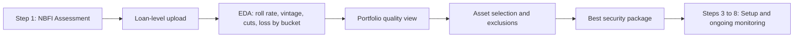

# Risk Infrastructure Solution for NCBA Bank

**An overview of the proposed workflow for enhanced credit decisioning and risk management of the wholesale NBFI portfolio.**

---

## Introduction to Kaleidofin

Established in 2017, Kaleidofin is a fintech platform on a mission to build a digital ecosystem that ensures finance for everyone, everywhere. The platform comprises the credit health assessment tool ki score, middleware rails, and the risk management dashboard ki monitor.

Kaleidofin collaborates with a diverse range of partners including Non-Banking Financial Institutions (NBFIs), Banks, and Development Finance Institutions (DFIs). Together, we are reimagining banking for the financially underserved segments by providing tailored loan products for low-income customers and businesses that operate within the informal sector.

### End-to-end flow (after FA)



---

## STEP 1: NBFI Assessment

This initial step provides a portal for the NCBA team to assess the financial health of a potential partner institution (NBFI). Users can upload multi-year audited financials, and the platform will automatically perform Balance Sheet, P&L, and Cashflow spreading. An automated report is generated, which includes key ratios and a proprietary financial score. The platform will flag any concerning trends or anomalous numbers that require further review. This summarised data can then be downloaded in a format compatible with NCBA's internal credit note.

### Key Features:
- **Upload Portal**: Upload multi-year audited financials
- **Automated Spreading**: Balance Sheet, P&L, and Cashflow analysis
- **Financial Scoring**: Proprietary score with trend analysis
- **Flag System**: Automatic identification of concerning metrics
- **Credit Note Export**: Download format compatible with internal systems
- **Standardization**: Reclassify management account line items to match the standardized (audited) format for year-on-year comparability; optional deep-dive notes on "Other expenses" or balance sheet line items

### Sample Output:

**P&L Spreading Example (MFI Kenya)**

| Metric (KES) | 2020 | 2021 | 2022 | 2023 | 2024 |
|--------------|------|------|------|------|------|
| Interest Income | 100.0M | 120.0M | 140.0M | 165.0M | 180.0M |
| Interest Expense | 40.0M | 45.0M | 50.0M | 55.0M | 60.0M |
| Impairment Losses | 5.0M | 4.0M | 6.0M | **12.0M** ⚠️ | 8.0M |
| Operating Expenses | 30.0M | 32.0M | 35.0M | 38.0M | 42.0M |
| Net Profit | 25.0M | 39.0M | 49.0M | 60.0M | 70.0M |

**Balance Sheet Spreading Example (MFI Kenya)**

| Metric (KES) | 2020 | 2021 | 2022 | 2023 | 2024 |
|--------------|------|------|------|------|------|
| Gross Loan Portfolio | 800.0M | 900.0M | 1.0B | 1.1B | 1.2B |
| Total Assets | 1.0B | 1.1B | 1.2B | 1.3B | 1.4B |
| Total Liabilities | 800.0M | 850.0M | 900.0M | 950.0M | 1.0B |
| Total Equity | 200.0M | 250.0M | 300.0M | 350.0M | 400.0M |
| PAR > 30 Days (%) | 4.5% | 3.8% | 4.2% | **7.1%** ⚠️ | 5.0% |

---

## STEP 2: Loan Book Assessment & Asset Selection

Once an NBFI is assessed as suitable, the platform supports **assessing** the credibility of the underlying collateral—not just displaying data—to inform Go/No-Go decisions and pool selection. After financial statement analysis, the full loan-level book must be ingested via one of three channels. Every individual loan is then scored using the ki score model, and the platform provides exploratory analysis plus filters so the NCBA team can identify and select the most optimal security package for the fixed charge.

### Loan-level data ingestion

Individual loan-by-loan details can be uploaded through:

1. **SFTP** – Automated batch upload from the NBFI's (or NCBA's) systems.
2. **NCBA user upload** – The NCBA relationship team uploads the loan-level file (e.g., received from the NBFI offline).
3. **NBFI user upload** – The NBFI logs into a client upload portal and uploads their loan book directly.

### Portfolio EDA and quality assessment

Once loan-level data is uploaded, the platform runs basic exploratory analysis to support:

- **Roll rate analysis** (e.g., 30→60→90+ days past due).
- **Vintage analysis** (cohort performance over time).
- **Cuts by:** geography, product, customer segment, loan size (and other dimensions in the data).
- **Estimated loss rates** (or expected loss) **by bucket** (e.g., by segment, vintage, product) to inform portfolio quality.

This EDA is used to (1) assess **overall portfolio quality** and (2) **identify and cull the best security package** (e.g., exclude weaker segments, select the optimal pool for the fixed charge).

### Filter Parameters:
- **KI Score Range**: 1-100 (lower is better)
- **Loan Amount**: Customizable range (e.g., 50k - 200k KES)
- **Residual Tenure**: Filter by remaining loan term (months)
- **Loan Interest Rate**: Filter by interest rate percentage
- **Geography**: Select by counties/regions
- **Loan Purpose**: Filter by use case (e.g., Boda-Boda, Agriculture)
- **Exclusions**: Ability to **exclude** specific loans or segments (e.g., sector such as MSME, product) from the collateral package when underperforming.

### Use Case:
NCBA can use EDA to understand quality and loss by segment, then use these filters and exclusions to define the actual collateral pool—creating an optimal asset pool that matches their risk appetite and portfolio diversification requirements.

---

## STEP 3: Centralised Setup & Configuration

This foundational step enables NCBA to establish a clear and consistent monitoring framework for each partner institution. The platform provides a configurable interface where NCBA can define the complete list of documents required, submission frequency, and all financial and operational covenants from the loan agreement (e.g., CRAR > 15%, Net NPA < 3%).

### Configuration Options:

**Covenant Setup:**
- Define financial ratios with threshold values
- Set operational metrics and benchmarks
- Configure breach notification rules
- Examples:
  - CRAR >= 15%
  - Net NPA <= 3%
  - Collection Efficiency >= 98%

**Document Requirements:**
- Specify required documents (e.g., MIS reports, audited financials)
- Set submission frequency (Monthly, Quarterly, Annually)
- Configure automated reminders and alerts

**Provisioning rules (optional):** Support for NBFI-specific and NCBA provisioning rules (e.g., loss at 60 vs 90 days) for dual NPL/classification views.

---

## STEP 4: Performance Data Integration

Once the covenants are set up for the transaction, the platform will establish integrations to receive ongoing performance data on the selected loans. Three flexible integration options will be provided:

### Integration Options:

1. **API Integration** (Recommended)
   - Real-time data exchange
   - Requires NBFI technical capability
   - Most efficient for continuous monitoring

2. **SFTP (Secure File Transfer Protocol)**
   - Automated batch file transfers
   - Secure and reliable
   - Good middle-ground option

3. **Manual Upload Portal**
   - For NBFIs without automated capabilities
   - Secure portal access
   - Guided upload process

---

## STEP 5: Automated Document Management

This step automates the tracking of compliance submissions. Partners are provided secure portal access to upload required documents. NBFIs can log in to upload **annual returns, tax compliance certificates, and management accounts** (and loan-level data where applicable; see Step 2). Each submission is time-stamped, and if a partner fails to submit a document on time, the system automatically triggers alerts to both NCBA and the partner institution for timely follow-up.

### Features:
- **Secure Portal (Client Upload Portal)**: Partner access for document uploads—including annual returns, tax compliance certificates, and management accounts
- **Time-stamped Records**: Automatic tracking of all submissions
- **Automated Alerts**: Notification system for overdue documents
- **Status Dashboard**: Real-time view of all compliance requirements

### Sample Document Status:

| Document | Frequency | Next Due | Status |
|----------|-----------|----------|--------|
| MIS Portfolio Report | Monthly | 01-Dec-2024 | ✅ Submitted |
| Compliance Certificate | Quarterly | 31-Dec-2024 | ⏳ Pending |
| Unaudited Financials | Quarterly | 31-Oct-2024 | 🚨 OVERDUE |

---

## STEP 6: Real-Time Covenant Benchmarking

This pillar forms the core of the risk detection engine. Upon document submission, the platform's intelligent parsing engine extracts relevant data points and automatically calculates all specified covenant ratios. This removes the need for manual spreadsheet calculations, reducing errors and saving significant time. The **Covenant breach engine** triggers in real time when thresholds are breached (e.g., PAR 30 %, collection efficiency) so the relationship team can act immediately.

### Key Capabilities:
- **Intelligent Data Extraction**: Automated parsing of financial documents
- **Ratio Calculation**: Automatic computation of all covenant metrics
- **Real-time Benchmarking**: Instant comparison against thresholds
- **Covenant Breach Engine**: Real-time triggers and immediate notifications for covenant violations so the relationship team can act immediately
- **Dual NPL/classification view**: (1) NPL status per the NBFI's own provisioning policy, (2) NPL status per NCBA's internal policy. NCBA's policy can be configured (e.g., write-off at 60 vs 90 days).
- **One-click quarterly review**: Generate a **Quarterly Performance Spread** that classifies the loan book into Normal, Watch, Substandard, and Loss automatically.
- **Historical Tracking**: Trend analysis over time

### Sample Covenant Status:

| Covenant | Required | Actual | Status |
|----------|----------|--------|--------|
| CRAR | >= 15.0% | 15.2% | ✅ Compliant |
| Net NPA | <= 3.0% | 3.8% | 🚨 BREACHED |
| Collection Efficiency | >= 98.0% | 98.2% | ✅ Compliant |

---

## STEP 7: Proactive Monitoring & Early Warnings

The platform's intelligent parsing engine extracts relevant data points and automatically computes all specified covenant ratios. This eliminates manual spreadsheet-based calculations, minimizes errors, and saves significant processing time. The computed values are instantly benchmarked against the pre-defined covenant thresholds, with automated alerts for any breaches.

### Early Warning System:
- **Trend Analysis**: AI-powered detection of deteriorating metrics
- **Predictive Alerts**: Warnings before covenant breaches occur
- **Scenario Modeling**: Project future performance based on trends
- **Risk Scoring**: Dynamic risk assessment at portfolio and NBFI level

### CRAR Movement Early Warning Example:

```
CRAR Movement Chart (Aug 2024 - Jun 2025)
━━━━━━━━━━━━━━━━━━━━━━━━━━━━━━━━━━━━━━━━━━
16.0% ┤ ●─●─●
15.5% ┤       ●─●
15.0% ┤- - - - - -●- - - - - - - - - - - - (Breach Threshold)
14.5% ┤            ○─○
14.0% ┤                ○─○
13.5% ┤                    ○
      └──────────────────────────────────
      Aug Sep Oct Nov Dec Jan Feb Mar Apr
      '24 '24 '24 '24 '24 '25 '25 '25 '25

Legend:
● Actuals (Green)
○ Estimates (Blue)
- Breach Threshold (Red)

⚠️ BREACH PREDICTED: CRAR expected to fall below 15.0% in January 2025
```

---

## STEP 8: Risk Monitoring Dashboard

A monitoring dashboard will be enabled for the Bank to observe the performance of the NBFI portfolios. Monitoring follows **two tiers**: (1) **Level 1—the wholesale loan**: NCBA's loan to the NBFI, using NCBA's provisioning rules; (2) **Level 2—the retail portfolio**: the thousands of end-borrowers within the NBFI's book, using the NBFI's provisioning rules. Provisioning rules are configurable per tier. This monitoring can be done at the transaction level, NBFI level, as well as the overall portfolio (NCBA) level. Key observations will be clearly highlighted, and analysis of the portfolio by composition, delinquency, and vintage will be provided. This will also help monitor NBFI performance across different geographies and track impact metrics.

### Dashboard Features:

**Multi-Level Monitoring (Two-Tier Risk Monitoring):**
- **Level 1 (Wholesale)**: NCBA's loan to the NBFI—metrics and provisioning per NCBA policy
- **Level 2 (Retail portfolio)**: Underlying loan book—metrics and classification per NBFI policy (and comparable view per NCBA policy)
- Transaction Level: Individual loan performance
- NBFI Level: Partner institution metrics
- Portfolio Level: Overall NCBA exposure and performance

**Key Metrics:**
- Principal Outstanding
- Collection Efficiency
- Live Loans Count
- Delinquency Rates (by vintage, geography, purpose)
- Covenant Compliance Status
- Document Submission Status

**Analytics & Reporting:**
- Portfolio Composition Analysis
- Geographic Distribution
- Loan Purpose Breakdown
- Vintage Analysis
- Delinquency Trends
- Impact Metrics (e.g., borrowers served, rural reach)

### Sample Portfolio Dashboard:

**Overall Metrics:**
- Principal Outstanding: KES 955M
- Collection Efficiency: 98.2%
- Live Loans: 9,450

**Portfolio Composition:**
- By Loan Purpose: Boda-Boda (30%), Agri-Finance (25%), Business (25%), Other (20%)
- By County: Nairobi (40%), Mombasa (25%), Nakuru (20%), Kisumu (15%)

---

## Implementation Timeline

| Phase | Activities | Duration |
|-------|------------|----------|
| Phase 1 | Setup & Configuration | 2-3 weeks |
| Phase 2 | Data Integration & Testing | 3-4 weeks |
| Phase 3 | Training & Go-Live | 1-2 weeks |
| **Total** | **End-to-End Implementation** | **6-9 weeks** |

---

## Key Benefits

### For NCBA Bank:
✅ **Efficiency**: Eliminate manual spreadsheet work and reduce processing time by 80%  
✅ **Accuracy**: Automated calculations minimize human error  
✅ **Proactive Risk Management**: Early warning system catches issues before they become critical  
✅ **Scalability**: Easily monitor multiple NBFI partners from a single platform  
✅ **Compliance**: Ensure all covenant and document requirements are met  
✅ **Visibility**: Real-time dashboard for portfolio performance

### For NBFI Partners:
✅ **Simplified Reporting**: Clear requirements and easy submission process  
✅ **Transparency**: Real-time view of compliance status  
✅ **Timely Alerts**: Never miss a submission deadline  
✅ **Partnership Strength**: Demonstrate strong governance and risk management

---

## Next Steps

1. **Discovery Workshop**: Deep-dive into NCBA's specific requirements and existing processes
2. **Pilot Program**: Start with 1-2 NBFI partners to validate the workflow
3. **Full Rollout**: Scale to entire wholesale NBFI portfolio
4. **Continuous Enhancement**: Regular reviews and feature additions based on feedback

---

## Contact Information

**Kaleidofin**  
Reimagining Banking for the Underserved

For more information about this proposal, please contact:  
[Your contact details here]

---

*© 2025 Kaleidofin. All rights reserved. This proposal is confidential.*

